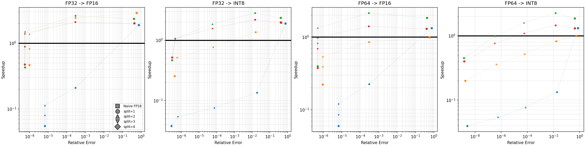

# Ozaki Scheme - Triton 原型实现

通过低精度 Tensor Core 模拟高精度矩阵乘法的 Triton 实现。

## 1. 功能概述

Ozaki Scheme 把高精度矩阵分解为多个低精度分片,通过多次低精度 GEMM 在外层高精度累加,达到接近高精度 GEMM 的效果。

**两种典型应用场景**

| 场景 | 输入 dtype | 分片 dtype | 目的 |
|---|---|---|---|
| 低精模拟高精 | FP64 / FP32 | FP16 / INT8 | 用低精 Tensor Core 算力换吞吐 |
| 低精输入高精中间 | FP16 / BF16 | FP32 | 避免直接低精 GEMM 的精度损失 |

**关键特性**

- 全 Triton kernel:融合矩阵分片 (split_matrix_kernel) 和交叉矩阵乘 (cross_gemm_kernel) 两个 kernel
- 多精度组合:输入 FP64/FP32/FP16/BF16 × 分片 FP32/FP16/BF16/INT8
- 支持任意 broadcastable 前置 batch 维,语义同 `torch.matmul`
- Optuna 自动调参:基于 TPE 贝叶斯优化的 kernel 参数搜索,替代穷举式 autotune

---

## 2. 算法

```
C = A @ B

Step 1  Split:    A → [(A_1, sa_1), ..., (A_l, sa_l)]   每个分片 alpha 位有效尾数
                  B → [(B_1, sb_1), ..., (B_l, sb_l)]
Step 2  Compute:  C_ij = tl.dot(A_i, B_j)               低精度 GEMM, 硬件累加
Step 3  Sum:      C = Σ_ij sa_i * sb_j * C_ij           外层高精度累加
```

**关键参数**

| 参数 | 含义 |
|---|---|
| `num_splits` | 分片数量,精度随 `num_splits` 提升,计算量 `O(num_splits^2)` |
| `alpha` | 每个分片的有效尾数位数,由 K 和硬件累加器位宽自动算出 |

`alpha = floor((acc_bits - log2(K)) / 2)`,其中 `acc_bits` 是 `tl.dot` 硬件累加器位数 (FP32→23,INT32→31),且不超过分片 dtype 自身的有效位数。`log2(K)` 项是为单次 `tl.dot` 内部 K 维归约预留的余量。

**精度层次**

精度由三个独立的累加位置共同决定:

1. **`tl.dot` 内部累加** (硬件): Tensor Core 给定,FP16/BF16 → FP32,INT8 → INT32。决定 `alpha` 上界,不可改。
2. **分片间累加** (软件): kernel 内 `out += dot_result * sa * sb`,FP64 输入用 FP64,其余 FP32,原则是取输入精度和分片精度中较高的那个。决定 `num_splits^2` 个 slice pair 求和的精度。
3. **输出 cast**: store 时转回用户的 input_dtype。

FP64 输入要达到 FP64 精度通常需要 `num_splits ≥ 6`,因为单分片只能携带 ~5–8 位有效尾数,需要多片在 FP64 外层累加里叠加。

---

## 3. 代码结构

### 核心模块 `ozaki_triton.py`

| 函数 / Kernel | 功能 |
|---|---|
| `ozaki_matmul` | 主入口:batch 处理 → 多 stream 并行 split → cross_gemm → reshape 输出 |
| `split_matrix` | Python 封装,调用 split kernel,自动处理输入转置的非连续内存情况 (通过 stride) |
| `cross_gemm` | Python 封装,调用 cross_gemm_kernel |
| `split_matrix_kernel` | Triton kernel: 输入矩阵 → `num_splits` 个分片 + scale |
| `cross_gemm_kernel` | Triton kernel: 融合 `num_splits^2` 个 GEMM + scale + 外层累加 |

### 自动调参模块 `mytuner.py`

| 组件 | 功能 |
|---|---|
| `OptunaAutotuner` | 继承 Triton `Autotuner`,用 Optuna TPE 采样替换穷举搜索 |
| `optuna_autotune` | 装饰器,drop-in 替换 `@triton.autotune` |

### 测试脚本 `test.py`

| 函数 | 功能 |
|---|---|
| `test` | 统一的精度与性能基准测试,遍历多种 dtype 组合和矩阵形状,记录结果到 CSV |
| `plot_summary` | 从 CSV 绘制散点折线图 (speedup vs relative error),直观对比精度-性能权衡 |

### 调参脚本 `tune.py`

| 函数 | 功能 |
|---|---|
| `tune_split` | 对多种矩阵形状自动调优 split_matrix_kernel 参数,并记录调参结果到csv用于分析 |
| `tune_gemm` | 对多种矩阵形状自动调优 cross_gemm_kernel 参数,并记录调参结果到csv用于分析 |

### 性能分析脚本 `perf.py`

| 函数 | 功能 |
|---|---|
| `run_bench` | 运行 Ozaki matmul 性能基准测试,集成 NCU 和 PyTorch Profiler,生成 Chrome trace JSON |

### 约束

- `num_splits ≤ 4` (累加器手动展开的限制)。
- A 和 B 的 dtype 必须相同。

---

## 4. 使用示例

```python
import torch
from ozaki_triton import ozaki_matmul

# 场景 A1: FP32 输入, FP16 分片 (经典 Ozaki)
C = ozaki_matmul(A_fp32, B_fp32, num_splits=2, slice_dtype=torch.float16)

# 场景 A2: FP64 输入, INT8 分片
C = ozaki_matmul(A_fp64, B_fp64, num_splits=4, slice_dtype=torch.int8)

# 场景 B: FP16 输入, FP32 分片 (避免直接 FP16 GEMM 损失)
# num_splits=1 即可, 单个 FP32 分片可无损包含 FP16 输入
C = ozaki_matmul(A_fp16, B_fp16, num_splits=1, slice_dtype=torch.float32)
```

---

## 5. 测试和分析

### 环境准备

- NVIDIA GPU (FP16 Tensor Core,推荐 A100 / H100)
- PyTorch + Triton + Optuna

```bash
pip install torch triton optuna
```

### 运行测试

```bash
source run_test.sh
```

输出文件:`test_results.csv`、`test_summary.txt`、`test_summary.png`

可在 `run_test.sh` 中调整的环境变量:

- `TRITON_PRINT_AUTOTUNING=1`:打印 autotune 选择的最优 config
- `TRITON_DISABLE_CACHE=1`:禁用 autotune 缓存,每次重新调优

### 测试结果参考

测试内容覆盖：
- **精度组合**: FP32→FP16、FP32→INT8、FP64→FP16、FP64→INT8
- **方法对比**: Naive FP16 (Baseline) vs Ozaki (split=1,2,3,4)
- **矩阵形状**: 随机生成 `(B,M,N,K)`，满足显存约束 `4×128³ < numel < 32×2048³`
- **测试指标**: Speedup、Max Error、Relative Error

关键结论：
- FP16 分片：`split=2` 即可达到 `rel_error ~10⁻⁶`，精度接近 FP32
- INT8 分片：`split=3~4` 可达到 `rel_error ~10⁻⁷~10⁻⁹`
- Speedup 随 split 数递减，小矩阵可能低于 1；大矩阵 split=1~2 可有正向加速



测试数据摘要（覆盖 4 个随机形状）：

**Scenario: FP32 → FP16**

| Method | Speedup (min~max) | Max Error (min~max) | Rel Error (min~max) |
|---|---|---|---|
| Naive FP16 | 1.883 ~ 2.878 | 3.634e+05 ~ 1.168e+06 | 4.138e-01 ~ 7.569e-01 |
| Ozaki(split1) | 0.210 ~ 2.619 | 1.199e+02 ~ 3.681e+02 | 2.914e-04 ~ 2.963e-04 |
| Ozaki(split2) | 0.114 ~ 1.501 | 4.062e-01 ~ 8.875e+00 | 5.634e-07 ~ 6.633e-06 |
| Ozaki(split3) | 0.079 ~ 0.884 | 4.062e-01 ~ 8.875e+00 | 5.610e-07 ~ 6.633e-06 |
| Ozaki(split4) | 0.055 ~ 0.475 | 4.062e-01 ~ 8.875e+00 | 5.610e-07 ~ 6.633e-06 |

**Scenario: FP32 → INT8**

| Method | Speedup (min~max) | Max Error (min~max) | Rel Error (min~max) |
|---|---|---|---|
| Naive FP16 | 1.886 ~ 2.339 | 4.223e+05 ~ 1.331e+06 | 4.134e-01 ~ 7.619e-01 |
| Ozaki(split1) | 0.135 ~ 2.830 | 8.333e+03 ~ 3.324e+04 | 1.456e-02 ~ 1.881e-02 |
| Ozaki(split2) | 0.076 ~ 1.868 | 2.769e+01 ~ 9.971e+01 | 5.692e-05 ~ 7.197e-05 |
| Ozaki(split3) | 0.053 ~ 1.055 | 3.281e-01 ~ 8.750e-01 | 4.440e-07 ~ 6.260e-07 |
| Ozaki(split4) | 0.038 ~ 0.518 | 2.188e-01 ~ 4.688e-01 | 2.711e-07 ~ 4.063e-07 |

**Scenario: FP64 → FP16**

| Method | Speedup (min~max) | Max Error (min~max) | Rel Error (min~max) |
|---|---|---|---|
| Naive FP16 | 0.988 ~ 1.830 | 4.154e+05 ~ 1.631e+06 | 4.119e-01 ~ 7.712e-01 |
| Ozaki(split1) | 0.225 ~ 2.138 | 1.295e+02 ~ 4.520e+02 | 2.904e-04 ~ 3.017e-04 |
| Ozaki(split2) | 0.122 ~ 1.336 | 3.075e-01 ~ 1.282e+01 | 4.887e-07 ~ 6.583e-06 |
| Ozaki(split3) | 0.085 ~ 0.809 | 3.015e-01 ~ 1.282e+01 | 4.852e-07 ~ 6.583e-06 |
| Ozaki(split4) | 0.060 ~ 0.398 | 3.015e-01 ~ 1.282e+01 | 4.852e-07 ~ 6.583e-06 |

**Scenario: FP64 → INT8**

| Method | Speedup (min~max) | Max Error (min~max) | Rel Error (min~max) |
|---|---|---|---|
| Naive FP16 | 0.992 ~ 1.856 | 3.563e+05 ~ 1.171e+06 | 4.351e-01 ~ 7.625e-01 |
| Ozaki(split1) | 0.133 ~ 2.265 | 7.295e+03 ~ 2.599e+04 | 1.432e-02 ~ 1.837e-02 |
| Ozaki(split2) | 0.078 ~ 1.604 | 2.920e+01 ~ 1.173e+02 | 5.663e-05 ~ 7.254e-05 |
| Ozaki(split3) | 0.053 ~ 0.971 | 2.067e-01 ~ 8.919e-01 | 3.197e-07 ~ 5.755e-07 |
| Ozaki(split4) | 0.040 ~ 0.450 | 8.577e-04 ~ 5.968e-03 | 1.452e-09 ~ 2.602e-09 |

### 调参分析

```bash
source run_tune.sh
```

调优结果输出到 `tune_log.csv`,包含各矩阵形状下的最优 `BLOCK/num_warps/num_stages` 配置。

### 性能分析

```bash
source run_perf.sh
```

- NCU 性能分析结果输出到 `report_ozaki.ncu-rep` 中,可用 Nvidia Nsight Compute 查看, 并总结到 `perf_summary.txt` 中。
- torch.profiler 分析结果输出到 `profile_trace.json` 中,可用 chrome://tracing 查看。

---

## 6. 附录

### 6.1 设计要点

#### `cross_gemm_kernel` 设计

- 方案一：独立累加版
  - 设计思路
    - `i` 和 `j` 都用 `tl.static_range` 编译期展开，所有 `num_splits^2` 个 slice pair 的计算路径在编译期生成
    - 预先开辟 `num_splits^2` 个独立累加器 (`acc00, acc01, ..., acc33`)，通过编译期 `if i == ... and j == ...` 静态分支访问
    - B tiles 在 K 循环开头预加载全部 `num_splits` 份，A tile 在 i 循环内现场 load (用完即弃)
    - Scale 应用统一放在 K 循环结束后，Tensor Core 流水不被打断
  - 优势
    - 数据复用最优：A 每个 (i, k) tile 只读一次并被所有 j 复用，B 每个 (j, k) tile 只读一次并被所有 i 复用，总 HBM 读取次数 `2 × L × (K/BLOCK_K)` (L = num_splits)
    - Tensor Core 流水连续：K 循环内只有 `tl.dot` 操作，scale 统一在 epilogue 应用，无 elementwise 操作打断 mma 流水
    - 硬件累加：`tl.dot(a, b, acc)` 三参数形式是硬件 fused mma-accumulate，比 `acc += tl.dot(a, b)` 少一次中间数据搬运
  - 劣势
    - 寄存器压力极大：`num_splits^2` 个累加器全部 live，L=2 时占用 4×BLOCK_M×BLOCK_N×4B，L=3 时 9×，L=4 时 16×
    - Occupancy 低：实测 L=2 时 occupancy 仅 12.5%-25%，大量寄存器限制并发 SM 数量
    - num_splits 上限：手动展开限制 `num_splits ≤ 4`
    - 代码冗余：累加器手动展开为 16 个独立变量，通过 `if i == ... and j == ...` 访问，是绕过 Triton IR bug 的工程妥协
- 方案二：ij-loop 版
  - 设计思路
    - `i` 和 `j` 都用 `range()` 运行时循环，每次 (i, j) 组合独立执行完整 K 循环
    - 只有 2 个累加器：`acc` (单 slice pair 的 K 维归约) 和 `out` (跨 slice pair 求和)
    - K 循环结束后立即 scale 并累加到 out，`acc` 随下一轮 (i, j) 被覆盖释放
    - 寄存器跨迭代复用，最小化同时 live 的累加器数量
  - 优势
    - 寄存器压力最小：仅 2 个累加器 live，occupancy 可达 25%
    - num_splits 无上限：理论上支持任意 L 值
    - 代码简洁：无需手动展开，无工程妥协
  - 劣势
    - 数据复用最差：A 每个 (i, j, k) tile 独立加载，总 HBM 读取次数 `L² × (K/BLOCK_K)`，A 吞吐占用高达 73.6%
    - Scale 打断 ij 循环：每个 slice pair 完成后立即 scale，elementwise 操作穿插在 dot 之间
- 方案三：折衷方案
  - 设计思路
    - `i` 用 `range()` 运行时循环 (跨迭代复用寄存器)
    - `j` 在 K 循环内手动展开 (编译期分支消除，A 只加载一次复用给所有 j)
    - 每个 i 有 `num_splits` 个独立累加器 (`acc0, acc1, acc2, acc3`)，但跨 i 复用同一组寄存器
    - A 在 K 循环内只加载一次，B 在各 j 分支间被覆盖 (不占额外寄存器)
  - 折中
    - 数据复用折中：A 读次数 `L × (K/BLOCK_K)` (与原版一致)，B 读次数 `L² × (K/BLOCK_K)` (与 ij-loop 版一致)
    - 寄存器压力折中：同时 live 的累加器 `L + 1` (每组 L 个 acc + out)，比原版 L² 大幅降低
- 实测结论：
  - 独立累加版 (方案一) 在实测中最优,说明数据复用是第一优先级,occupancy 是次要因素。
  - A 读次数从 L 增加到 L² 导致吞吐从 ~30% 暴涨到 73.6%，内存带宽瓶颈成为主导。原版通过预加载 B tiles 和 A tile 即时加载复用，实现了最优的 HBM 读取模式。寄存器压力导致的低 occupancy 可以通过 `maxnreg` 参数搜索在 spill 代价和 occupancy 收益间找平衡。

| 方案 | A 读次数 | B 读次数 | 累加器数 | Occupancy | Duration |
|---|---|---|---|---|---|
| 独立累加版 (L² 个 acc) | L | L² | L²+1 | 12.5% | 1.35ms |
| ij-loop版 (2 个 acc) | L² | L² | 2 | 25% | 2.06ms |
| 折衷方案 (L+1 个 acc) | L | L² | L+1 | - | 1.8ms |

#### `split_matrix_kernel` 设计

- K 维分块方案:采用两趟扫描 (two-pass) 方式——第一趟扫描所有 K-tile 求 row_max,第二趟提取分片并更新 residual。residual 通过 HBM buffer 在 split 和 K-tile 间传递。支持任意大小的 K 维,寄存器压力小,但读写 HBM 次数多。
- 全融合方案:整行一次性加载到寄存器,`num_splits` 次迭代在 SRAM 内完成,residual 不写回 HBM。读写 HBM 次数最少,但寄存器 spill 严重,且限制 `BLOCK_K ≥ K`。
- 实测 K 维分块方案更优

#### 其他设计

- **多精度统一接口**:所有 dtype 决策通过 `_select_*` 函数集中管理,kernel 内通过 constexpr 静态特化,无运行时分支。
- **Optuna 自动调参**:基于 TPE (multivariate) 贝叶斯优化,支持 `maxnreg` 参数搜索,逐参数 suggest 避免组合爆炸,重复配置缓存跳过重复 benchmark。prune_configs 机制与 Optuna 搜索协同工作——先用 `effective_space` 缩小搜索空间,再用 `inf` 惩罚兜底非法组合。

### 6.2 优化历史

#### 融合 split_matrix 为单 Triton kernel  `9603259`

将原本 Python 循环中每个分片独立的 `amax` / `frexp` / `ldexp` / 除法 / 转 FP16 / 残差更新等步骤融合进单个 kernel。整行 A 一次性加载,`num_splits` 次迭代在 SRAM 内完成,residual 不写回 HBM。用 `tl.exp2(tl.ceil(tl.log2(...)) - ALPHA)` 替代 `frexp + ldexp`,用 `tl.static_range` 编译期展开 split 循环。

收益:分片阶段从 `O(num_splits × 6)` 个 kernel 压缩成 1 个,HBM 流量从多次往返降至 1 读 + 1 写。

#### 融合 scale 进 GEMM epilogue  `5e2e7c3`

将 `scale_a[:, None] * scale_b[None, :]` 融合进 matmul kernel 的写回阶段,用 `tl.atomic_add` 直接累加到 C,省掉临时张量和单独的 add kernel。配套加 `reset_to_zero=['C_ptr']` 防止 autotune benchmark 污染传入的 C。

收益:每次 GEMM 省掉 2 个 elementwise kernel。

#### 跨 slice pair 融合进单 kernel  `1695f5c`

将 `num_splits^2` 次独立 GEMM 调用融合进单 kernel。K 主循环内一次性加载所有分片的 A/B tile,维护一个累加器进行 `num_splits^2` 次累加计算。

- A/B 的 HBM 读取次数:`num_splits^2` → `2 × num_splits` (splits=3 时 9 → 6)
- C 只写一次,省掉 `num_splits^2 - 1` 次中间累加读写
- 移除了原来非融合情况下所需的 `tl.atomic_add` 和 `reset_to_zero`(单 kernel 内不再需要)

Kernel 签名变化:`A_slices` 形状 `(num_splits, M, K)`,`B_slices` 形状 `(num_splits, K, N)`,scales 同步带 split 维,`NUM_SPLITS` 作为 constexpr。scale 提到 K 循环外预加载。

#### 累加与 scale 解耦,scale 移到 K 循环外

维护 `num_splits^2` 个独立累加器;K 循环内只做纯 `tl.dot(a, b, acc)`,K 循环结束后 epilogue 一次性应用 scale。

收益:
- Tensor core 流水连续: 原来 K 循环内每次 dot 后都有 `dot_out * sa * sb` 两次 FP32 elementwise 乘法,占用 CUDA core,拖慢 Tensor core 流水。现在 K 循环里**只有 mma**,Tensor core 连续发射不被打断。
- mma 硬件累加: `tl.dot(a, b, acc)` 三参数形式是硬件 fused mma-accumulate,比 `acc += tl.dot(a, b)` 少一次中间数据搬运。
- scale 计算次数减少: 总 elementwise 操作数从 `num_splits^2 × (K/BLOCK_K)` 降到 `num_splits^2`,对 K=1024、BLOCK_K=32 减少 32×。

妥协:
- 累加器手动展开为 16 个独立变量: 用 `acc00, acc01, ..., acc33` 16 个独立标量,通过编译期 `if i == ... and j == ...` 静态分支访问。Triton 对 list 的 IR 处理有 bug,2D list 索引 / 跨循环 list 重赋值会触发 segfault。展开成独立变量是绕过编译器 bug 的工程妥协,功能上等价但保证编译通过。`num_splits ≤ 4` 的限制由此引入。
- 存储 `num_splits^2` 个累加器增大了寄存器压力。

#### A tile 不预加载,B tile 预加载

每次内层 i 循环现场 load `a_i`(用完即弃);b_tiles 在 K 循环开头预 load 全部 num_splits 份。

收益:同时活跃的 A tile 从 `num_splits` 降到 1,寄存器压力减半。B 预加载是因为每个 b_j 在 j 循环里被 num_splits 个不同的 a 复用,预加载省掉重复 HBM 读取。这是访存量和寄存器压力的权衡。

#### Swizzled grid ordering (group_m=8)

grid 从 3D `(BN, Mb, Nb)` 改为 2D `(BN, Mb*Nb)`,kernel 内部按 group swizzle 重新解出 `pid_m, pid_n`。

收益:标准行优先 grid 调度下,相邻 program 沿 N 方向扫,共享的 A tile 早早被 L2 evict。Group swizzle 让连续 program 集中在 8×N 的小区域,A 和 B tile 都能被 L2 反复命中。Ozaki kernel 因为 `num_splits^2` 倍的 slice 读取,L2 命中率影响被放大,这个优化收益比普通 GEMM 更大。

#### Split kernel K 维分块 (two-pass)  `fb27c87`

将原来要求 `BLOCK_K ≥ K` (整行驻留 SRAM) 的 split kernel 改为两趟扫描:第一趟遍历所有 K-tile 求 row_max,第二趟用 row_max 计算 scale 后逐 tile 提取分片并更新 residual。residual 通过 HBM buffer 在 split 间传递。

收益:解除了 `BLOCK_K ≤ 8192` 的 K 维大小限制,降低了寄存器压力 (不再需要整行 K 驻留寄存器),BLOCK_K 成为可调参数由 autotune 优化。

代价:每个 split 需要额外一趟 K 维读取 (row_max 扫描),且 residual 需要写回 HBM buffer。

#### Optuna 自动调参替换穷举式 autotune  `057789e`

新增 `mytuner.py`,实现 `OptunaAutotuner` 继承 Triton 原生 `Autotuner`,用 Optuna TPE 采样替换穷举搜索。

- 逐参数 `suggest_categorical`,克服多参数组合爆炸
- `multivariate=True` 建模参数间交互 (如 BLOCK_M 与 num_warps 的关联)
- 重复配置缓存,避免重复 benchmark
- 与原生 `prune_configs`、`_bench`、磁盘缓存等机制完全兼容;`run()` 方法与原生代码只有一行差异,便于跟随上游 Triton 版本更新

- `maxnreg` 参数控制编译器寄存器限制,在 spill 代价和 occupancy 收益之间寻优

#### 消除 B 转置拷贝 `cec529b`

**消除 B_T.contiguous()**:对 B 矩阵的 split 直接使用 `B3.transpose(-1,-2)` 的 view,通过 stride 传递给 kernel。split_matrix_kernel 本身通过 stride 寻址,天然支持非连续输入。

收益:省掉 ~858μs 的整张量拷贝 elementwise kernel。

代价:B 的 K 维非连续访问导致 coalescing 效率降低,split B 从 ~593μs 增至 ~797μs,但净省 ~550μs。

#### 多 stream 并行  `cec529b`

split A 和 split B 在独立 CUDA stream 上并发执行。B 的 split 先启动 (耗时更长),A 的 split 在另一个 stream 上并行。cross_gemm 通过 `main_stream.wait_stream()` 同步后执行。

收益:GPU 端总时间从 `split_A + split_B + gemm` 降为 `max(split_A, split_B) + gemm`,实测省 ~13%。

配套改动:
- 扩展 split kernel 参数范围 (BLOCK_M: 2^0~2^5, BLOCK_K: 2^6~2^11),适应非连续输入下不同的最优 tile 形状
- 新增 `prune_split` 函数,按 `bm * bk ≤ 2048` 和 `num_warps` 合理性过滤配置

### 6.3 功能扩展历史

#### 支持 broadcastable batch 维  `533e8f2`

通过 `_canonicalize_batch` 统一 broadcast 逻辑:`torch.broadcast_shapes` 算出统一 batch shape,`expand` 零拷贝扩展,`reshape + contiguous` 拍平为 3D。kernel 加 batch 维 program_id,通过 stride 偏移指针。语义和 `torch.matmul` 一致,纯 2D 输入也兼容。

#### 多精度支持  `e90f7f2`

支持输入 FP64/FP32/FP16/BF16 × 分片 FP32/FP16/BF16/INT8 的任意组合。

- 三个累加位置的 dtype 通过 `_select_dot_accum_dtype` 和 `_select_out_accum_dtype` 集中管理
- `compute_split_bits` 参数化,根据 `dot_accum_dtype` 选 acc_bits
- `cross_gemm_kernel` 新增 `OUT_ACCUM_DTYPE` constexpr,FP64 输入时外层累加器为 FP64,确保跨 slice pair 求和无损
- INT8 路径在 split kernel 里加了 round-half-away-from-zero + clamp;cross_gemm_kernel 里 `tl.dot` 显式 `out_dtype=tl.int32`,转 FP32 后乘 scale
- Autotune key 加入 `IS_INT_SLICE`、`IS_FP64_OUT`、`IS_FP64_RESIDUAL`,不同精度组合各自寻优

### 6.4 待办

- [ ] FP64 路径的 tile 范围进一步调优 (FP64 累加器寄存器占用是 FP32 的 2×)
- [ ] 探索 CUDA Graph 捕获以消除 CPU launch 开销
- [ ] cross_gemm_kernel 寄存器压力优化 (当前 NUM_SPLITS=2 时 occupancy 仅 12.5-25%)

---

## 参考文献

- Ozaki et al., *Error-free transformations of matrix multiplication by using fast routines of matrix multiplication and its applications*, Numerical Algorithms, 2012
- Ootomo et al., *DGEMM on Integer Matrix Multiplication Unit*, IJHPCA, 2024
- Ozaki et al., *Ozaki Scheme II (CRT-based)*, arXiv:2504.08009, 2025
